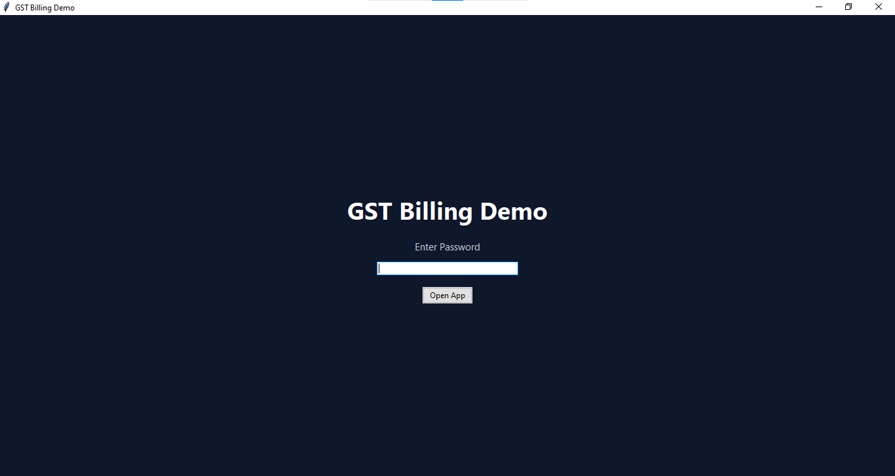
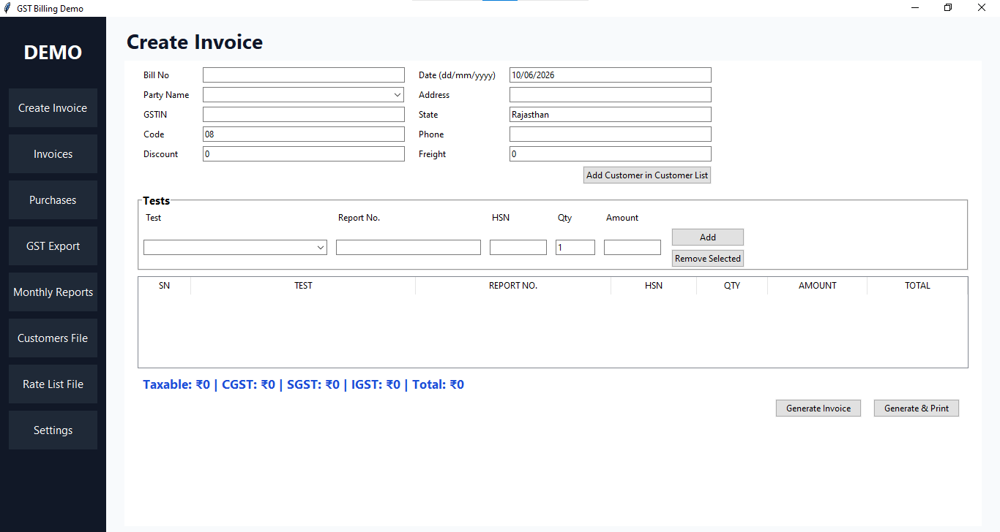
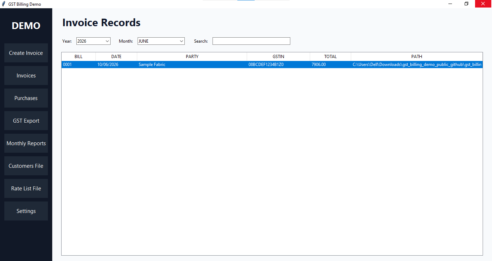
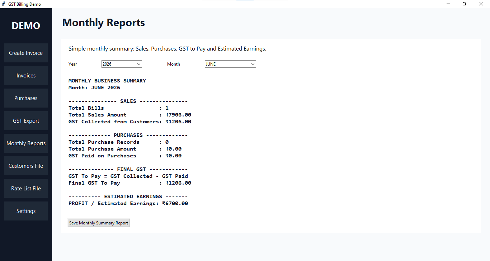

# GST Billing Demo

A Python desktop billing and GST management application designed for small businesses and testing laboratories.

This project was created as a learning project to explore desktop application development, invoice generation, customer management, GST exports, and business automation using Python.

## Features

### Invoice Management

* Generate GST invoices
* Multiple test/item entries per invoice
* Report Number support
* Freight and Discount handling
* Amount in words conversion
* Print-ready invoice generation

### Customer Management

* Customer database
* Customer autocomplete
* GSTIN storage
* Address and contact management

### GST Management

* Sales GST exports
* Purchase GST exports
* Monthly GST records
* GST calculation automation

### Records & Reports

* Invoice records
* Purchase records
* Monthly summaries
* Search invoices by customer name

### Data Protection

* Backup creation
* Backup restoration
* Password protection
* Configurable records storage location

### Login Page

### Dashboard

### Invoices Tab

### Monthly Reports

## Technologies Used

* Python
* Tkinter
* SQLite
* OpenPyXL
* Python-Docx
* Pillow
* QRCode

## Download

Download the latest version from the Releases section.

1. Open the Releases page.
2. Download the latest ZIP file.
3. Extract the ZIP.
4. Run the application executable.
5. No Python installation is required.

## Disclaimer

This repository contains a demonstration version only.

No real customer information, GST data, invoices, bank details, QR codes, or business records are included.

## Learning Goals

This project helped explore:

* Desktop software development
* Database management
* Business automation
* Invoice generation
* Excel automation
* Backup and recovery systems

## Note

This project was developed as a learning project with AI assistance.

AI tools were used to help generate, review, and improve code. The project requirements, testing, feature design, debugging, and implementation decisions were directed by the developer.

## Author

Parth Paliwal

Grade 9 Student | Python Learner | Aspiring Software Engineer
